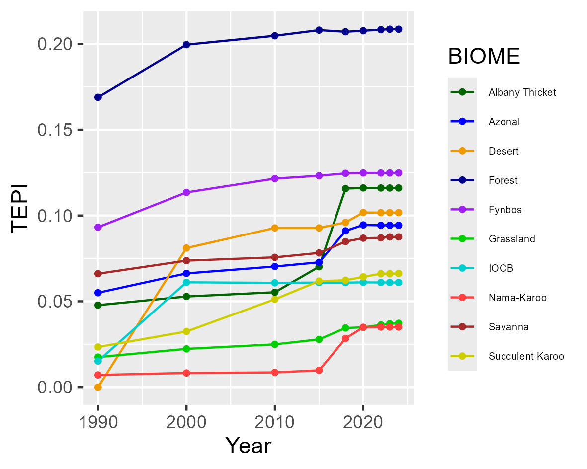

## **Workflows for undertaking the Terrestrial Ecosystem Protection Index (TEPI)**

### **National Biodiversity Assessment - South Africa**

*South African National Biodiversity Institute (SANBI)*

September 2025

#### **Summary**

This Repository contains a workflow that results in the Terrestrial Ecosystem Protection Index for South Africa. The terrestrial ecosystem map (vegetation), land cover change data (1990-2022) and protected areas time series (1990-2024) data were prepared in ARCGIS PRO and imported to R. The three layers were aligned, stacked and then cross tabulated (using the R terra package) for each time point (1990, 2000, 2010, 2015, 2018, 2020, 2022, 2023, 2024). The spatial analysis steps are contained in [Terr_protection_timeseries.qmd](Terr_protection_timeseries.qmd) and the output is [sa_pa_all.csv](outputs/sa_pa_all.csv)

The results were summarised in R (using tidyverse package) and TEPI was calculated for each biome and overall in the script [Tepi.qmd](Tepi.qmd). The main outputs are main outputs are [tepi_sum_biome.csv](outputs/tepi_sum_biome.csv) and the plots below.

| BIOME TEPI | Overall TEPI |
|----|----|
|  |  |

#### 
